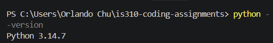
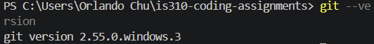
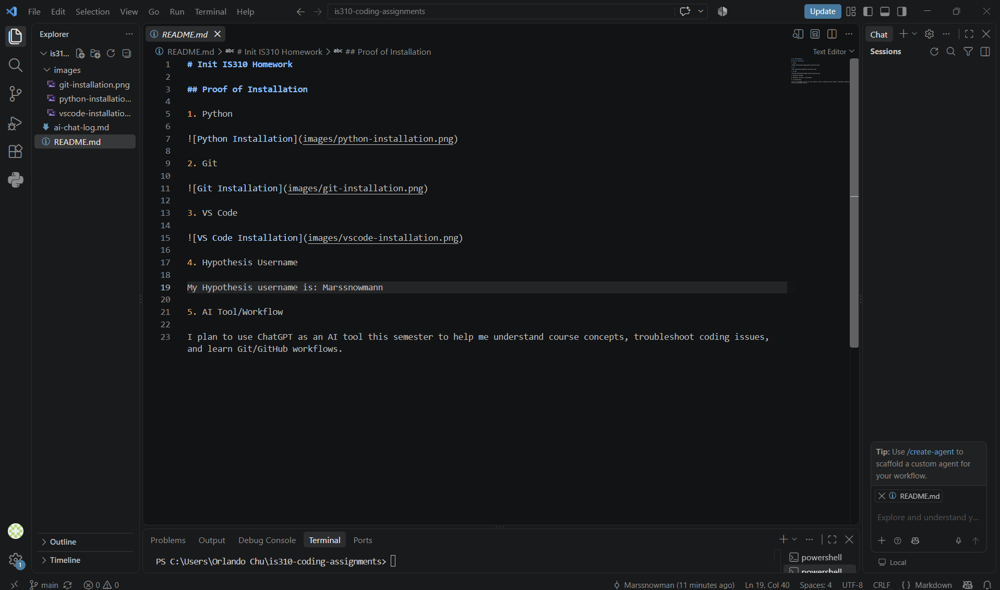

# Init IS310 Homework

## Proof of Installation

1. Python

2. Git

3. VS Code

4. Hypothesis Username

My Hypothesis username is: Marssnowmann

5. AI Tool/Workflow

I plan to use ChatGPT as an AI tool this semester to help me understand course concepts, troubleshoot coding issues, and learn Git/GitHub workflows.